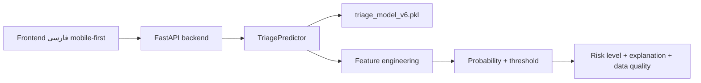

# مستند معماری سیستم

## نمای کلی

سامانه «پشتیبان تصمیم‌گیری تریاژ اورژانس» یک MVP هوشمند، mobile-first و API-first است. کاربر اطلاعات قابل دسترسی در لحظه تریاژ را وارد می‌کند و backend با استفاده از مدل ML نسخه `v6` احتمال بحرانی بودن بیمار را برمی‌گرداند.

معماری با این اصل طراحی شده است: مدل باید در سناریوی واقعی تریاژ قابل دفاع باشد، نه فقط روی dataset عدد خوب تولید کند.

## اجزای اصلی



## لایه داده

منبع فعلی داده `data/raw/triage.csv` است. ستون‌های مجاز برای مدل از این گروه‌ها انتخاب شده‌اند:

- سن، جنسیت و روش ورود
- علائم حیاتی اولیه
- شکایت اصلی (`cc_*`)
- سابقه مراجعه، بستری و جراحی
- سابقه‌های بالینی قابل پرسش یا قابل مشاهده در EHR

ستون‌های حذف‌شده:

- labs، meds، imaging، disposition و تشخیص‌های بعد از تریاژ
- race، ethnicity و insurance تا قبل از بررسی fairness

## مهندسی ویژگی

فیچرهای مهم ساخته‌شده:

- `shock_index`
- `map`
- `pulse_pressure`
- `hr_rr_ratio`
- `vital_severity_score`
- `available_vital_count`
- `has_core_vitals`
- missingness flags
- `is_elderly` و `is_pediatric`

در v6 واحد دمای dataset از Fahrenheit به Celsius تبدیل می‌شود تا تفسیر بالینی درست باشد.

## مدل

`ml/train.py` سه مدل را آموزش و مقایسه می‌کند:

- Random Forest
- Extra Trees
- XGBoost

در اجرای v6، XGBoost بهترین validation AUC را داشت و predictor عملیاتی شد. threshold روی validation انتخاب شده و test فقط برای گزارش نهایی استفاده شده است.

متریک تست v6 در حالت safety-first:

| معیار | مقدار |
|---|---:|
| AUC | 0.8947 |
| Average Precision | 0.8034 |
| Recall | 0.9241 |
| Precision | 0.5269 |
| FPR | 0.3598 |

## API

backend در `backend/main.py` پیاده‌سازی شده است.

Endpointها:

- `GET /health`
- `GET /model-info`
- `POST /predict`
- `GET /` برای frontend
- `GET /docs/...` برای دسترسی نمایشی به مستندات تحویلی از داخل MVP

نمونه خروجی:

```json
{
  "model_version": "v6",
  "operational_mode": "safety_first_hybrid",
  "model_probability": 0.81,
  "critical_probability": 0.87,
  "threshold": 0.2962,
  "risk_level": "critical",
  "triage_band": "ESI 1-2 priority suggested",
  "recommended_action": "Immediate clinical review recommended",
  "safety_flags": ["red flag: chest pain with high-risk cardiac history"],
  "next_best_actions": ["notify senior triage nurse or emergency physician"],
  "data_completeness": 0.5,
  "confidence_band": "medium",
  "missing_recommended_fields": ["systolic blood pressure"]
}
```

## Frontend

frontend در `frontend/` پیاده‌سازی شده است و ویژگی‌های زیر را دارد:

- زبان فارسی و راست‌به‌چپ
- طراحی mobile-first
- سناریوی demo بحرانی، متوسط، sparse و cardiac
- نمایش probability، سطح ریسک، کامل بودن داده و فیلدهای پیشنهادی باقی‌مانده
- چک‌باکس سابقه‌های بالینی
- PWA shell شامل manifest، service worker و آیکن نصب
- action bar موبایل و تب‌های ورودی/خروجی/پروژه
- هشدار ethical/disclaimer

## Safety-first Hybrid Layer

در فاز نهایی، خروجی inference از «فقط احتمال مدل» به یک تصمیم‌یار عملیاتی تبدیل شد. `model_probability` احتمال خام مدل v6 را نشان می‌دهد و `critical_probability` خروجی عملیاتی safety-first است. اگر red flagهای واضح مثل SpO2 زیر ۹۰، فشار سیستولیک زیر ۹۰، نرخ تنفس بسیار غیرطبیعی یا درد قفسه سینه با سابقه قلبی وجود داشته باشد، سیستم `safety_flags` و `next_best_actions` را برمی‌گرداند. این لایه برای جایگزینی متخصص نیست؛ برای شفاف‌سازی و کاهش ریسک در شرایط داده ناقص طراحی شده است.

## پشتیبانی از ورودی ناقص

تمام فیلدهای اصلی به جز قواعد اعتبارسنجی حدی optional هستند. مدل با `reindex(..., fill_value=0)` و missingness features می‌تواند با ورودی ناقص کار کند. خروجی، اعتماد را پنهان نمی‌کند و `confidence_band` را نشان می‌دهد.

## تصمیم‌های قابل دفاع

| تصمیم | دلیل |
|---|---|
| API-first | جداسازی مدل از UI و امکان توسعه موبایل/آفلاین |
| Mobile-first | تناسب با محیط سریع اورژانس |
| حذف leakage | قابل دفاع بودن مدل در لحظه واقعی تریاژ |
| Threshold safety-first | اولویت اخلاقی کاهش False Negative |
| حذف متغیرهای حساس | کاهش ریسک bias تا قبل از تحلیل fairness |
| Model Card | شفافیت برای استاد و ذی‌نفع |

## محدودیت‌های معماری

- مدل محلی هنوز برای deployment واقعی سبک‌سازی نشده است.
- SHAP فعلاً batch/report است و آنلاین در API محاسبه نمی‌شود.
- داده واقعی بیمارستانی و تایید متخصص لازم است.
