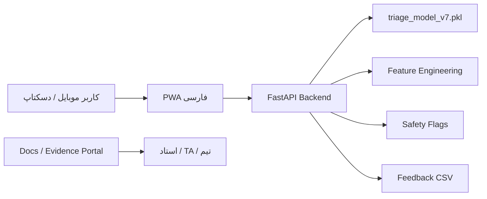

# معماری سیستم

سامانه «پشتیبان تصمیم‌گیری تریاژ اورژانس» یک MVP هوشمند، mobile-first و API-first است. کاربر اطلاعات قابل دسترسی در لحظه تریاژ را وارد می‌کند و backend با استفاده از مدل `v7` احتمال بحرانی بودن بیمار را برمی‌گرداند. خروجی سامانه فقط decision-support است.

## معماری فعلی



## اجزای اصلی

| جزء | مسیر | نقش |
|---|---|---|
| Frontend | `frontend/` | UI فارسی، mobile-first، PWA، feedback form |
| Backend | `backend/` | API، inference، feedback endpoints |
| ML | `ml/` | feature engineering، آموزش مدل، inference helper |
| Model artifact | `models/triage_model_v7.pkl` | مدل deploy-ready بدون دیتاست خام |
| Reports | `reports/model/` | metrics و نمودارهای ارزیابی |
| Docs | `docs/` | مستندات فنی، مدیریتی و Agile |
| Deployment | `Dockerfile`, `render.yaml`, `Procfile` | اجرای غیرلوکال |

## جریان داده

1. کاربر شکایت اصلی، سن، علائم حیاتی و سوابق قابل پرسش را وارد می‌کند.
2. API داده را validate می‌کند.
3. همان feature engineering آموزش روی ورودی اجرا می‌شود.
4. مدل v7 احتمال خام بحرانی بودن بیمار را محاسبه می‌کند.
5. safety flags و data completeness به خروجی اضافه می‌شوند.
6. UI نتیجه، اقدام بعدی، عوامل مؤثر و فیلدهای پیشنهادی باقی‌مانده را نشان می‌دهد.

## کنترل leakage

مدل فقط از داده‌های قابل دسترسی در زمان تریاژ استفاده می‌کند. موارد زیر حذف شده‌اند:

- آزمایش، دارو و تصویربرداری بعد از تریاژ
- disposition و تشخیص‌های بعدی
- ستون‌های `*_last` که می‌توانند بعد از تریاژ ثبت شده باشند
- race/ethnicity/insurance تا قبل از تحلیل fairness

## مدل v7

predictor عملیاتی: `xgboost_v7_balanced`

| معیار | مقدار تست |
|---|---:|
| AUC | 0.9041 |
| Average Precision | 0.8202 |
| Recall | 0.9246 |
| Precision | 0.5447 |
| FPR | 0.3352 |

## پشتیبانی از ورودی ناقص

همه فیلدهای بالینی اصلی optional هستند. خروجی API شامل موارد زیر است:

- `data_completeness`
- `confidence_band`
- `missing_recommended_fields`
- `safety_flags`
- `next_best_actions`

این طراحی برای محیط واقعی اورژانس است که ممکن است در لحظه اول فقط ۳ یا ۴ داده موجود باشد.

## مسیر deploy

برای تست روی گوشی در شبکه داخلی:

```powershell
.\scripts\start_public_webapp.ps1
```

برای deploy ابری:

```powershell
docker build -t emergency-triage-mvp .
docker run --rm -p 8000:8000 emergency-triage-mvp
```

در سرویس‌هایی مثل Render، فایل `render.yaml` و Dockerfile آماده‌اند. نسخه موبایلی کامل برای نصب PWA نیازمند HTTPS است.

## فاز Laravel / Android

در فاز بعد، Laravel نباید جایگزین مدل شود؛ نقش Laravel لایه محصولی و عملیاتی است:

| لایه | مسئولیت |
|---|---|
| FastAPI | inference و مدل |
| Laravel | auth، consent، audit log، feedback management، admin panel |
| PWA/TWA | تجربه کاربری و انتشار در بازار اندرویدی |
| Database | بازخورد، تنظیمات نسخه و لاگ غیرحساس |

برای انتشار در بازارهای اندرویدی، مسیر پیشنهادی PWA روی HTTPS + Android wrapper با Trusted Web Activity یا Capacitor است.
