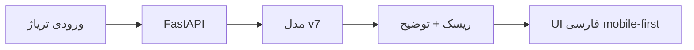

<!-- rtl-normalized -->

# محتوای پیشنهادی پوستر A0

ابعاد نهایی: حداقل A0، 84.1 در 118.9 سانتی‌متر

## تیتر اصلی

سیستم هوشمند پشتیبان تصمیم‌گیری تریاژ اورژانس

## زیرتیتر

یک MVP تصمیم‌یار برای کمک به شناسایی سریع‌تر بیماران بحرانی در شرایط ازدحام و بحران درمانی

## بخش 1: مسئله، راه‌حل و ارزش

در اورژانس‌های شلوغ، تاخیر در تشخیص بیمار بحرانی می‌تواند پیامد انسانی جدی داشته باشد. این سامانه با دریافت علائم حیاتی، شکایت اصلی و سابقه بالینی قابل پرسش، احتمال بحرانی بودن بیمار را تخمین می‌زند و خروجی قابل توضیح ارائه می‌کند.

ارزش اجتماعی و ملی: کمک به تاب‌آوری نظام درمانی کشور، کاهش ریسک از دست رفتن بیمار پرخطر و استفاده بهتر از ظرفیت محدود اورژانس.

## بخش 2: تصویر محصول

قرار دادن screenshot واضح از:

- صفحه اصلی UI
- خروجی سناریوی بحرانی
- خروجی سناریوی sparse با data completeness

## بخش 3: معماری کوتاه

## بخش 4: KPIهای فعلی

| KPI | مقدار |
|---|---:|
| AUC | 0.9041 |
| Average Precision | 0.8202 |
| Recall بیماران بحرانی | 0.9246 |
| Precision | 0.5447 |
| FPR | 0.3352 |
| API health | Pass |
| پشتیبانی از ورودی ناقص | Pass |

## بخش 5: کار تیمی و ساعات

| عضو | نقش | ساعت |
|---|---|---:|
| محمدامین پورمند | Project Lead / ML & System Architect | 47h |
| محمدرضا آرمان پور | Project Control & Metrics Coordinator | 18h |
| محدثه حاتمی کیا | UI/Documentation & QA Coordinator | 23h |

توزیع کل: 88 ساعت

## بخش 6: Burndown

برای پوستر، از جدول `docs/agile-dashboard.md` نمودار خطی بسازید:

- خط ایده‌آل: از 42 تا 0 story point
- خط واقعی: از 42 تا 2 story point
- توضیح کوتاه: «بهبود انتهایی به دلیل retrain مدل v7، featureهای بالینی جدید و کنترل سخت‌گیرانه‌تر leakage رخ داد.»

## بخش 7: مسیر Agile

| Sprint | خروجی |
|---|---|
| Sprint 0 | انتخاب مسئله و scope |
| Sprint 1 | مدل و مستندات پایه |
| Sprint 2 | API و UI |
| Sprint 3 | مدل v6، SHAP و مستندات مدل |
| Sprint 4 | UI فارسی، PWA و بسته تحویل |
| Sprint 5 | evidence مدیریت پروژه، feedback form و poster assets |
| Sprint 6 | مدل v7، deploy عمومی وب‌اپ، QR موبایل و Jira/KM assets |

## بخش 8: پیش‌بینی جذب کاربر تا پایان تیر

کاربر در این پروژه یعنی کاربر آزمایشی/بازخورددهنده دانشگاهی.

| هفته | کاربران تجمعی |
|---|---:|
| هفته 1 | 5 |
| هفته 2 | 12 |
| هفته 3 | 22 |
| پایان تیر | 35 |

## بخش 9: KPIهای آینده

- دریافت بازخورد از حداقل 2 فرد آشنا با حوزه سلامت
- 5 سناریوی demo تاییدشده
- بررسی fairness برای سن و جنسیت
- PWA عمومی و قابل نصب روی موبایل
- زمان پاسخ API کمتر از 300ms در demo

## بخش 10: چالش‌ها و درخواست بازخورد

- نیاز به اعتبارسنجی بالینی واقعی
- تحلیل False Negativeها
- بررسی bias پیش از کاربرد عملی
- سبک‌سازی مدل برای اجرای آفلاین

## هشدار اخلاقی

این سامانه فقط decision-support است و جایگزین تصمیم پزشک، پرستار یا پروتکل رسمی بیمارستان نیست.

## QR و لینک

قرار دادن QR به GitHub:

`https://github.com/AminHatesProgramming/emergency-triage-mvp`

